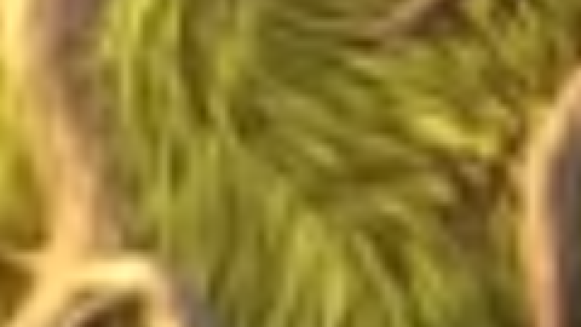
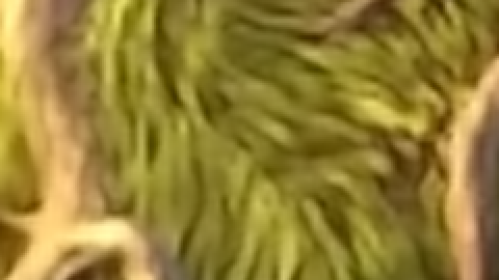
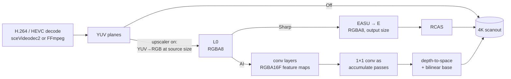

# Real-time video upscaling on PS5, bare-metal

Research notes, measurements and code from adding a video upscaler to
[EVO Player](https://github.com/sainsaji/EVO-PLAYER-PS5), a homebrew media player
for jailbroken PS5 consoles. Video smaller than the TV — 540p, 720p, 1080p on a
4K panel — used to be stretched with a single bilinear fetch. It can now go
through **AMD FSR 1** or one of three **Anime4K convolutional networks**. All
of them run in real time as fragment shaders, submitted straight to the GPU
through Sony's low-level `sceAgc` interface. There is no game engine or
graphics API in between.

Everything here was measured on a **PS5 Pro** (firmware 12.70) driving a 4K
HDR TV. Every comparison image is a **lossless, pixel-exact capture of the
console's scanout**.

> [!CAUTION]
> **The images on this page are not full quality.** GitHub scales and
> compresses images shown inside a README, so they look softer than what the
> console produced. To see the real, lossless pixels, open an image file
> directly, for example
> [comparisons/bbb-1080p/grid.png](https://github.com/sainsaji/ps5-upscalar-research/blob/main/comparisons/bbb-1080p/grid.png).
> Click **Raw** or **Download** there for the full-size file. Every capture set
> is in [`comparisons/`](comparisons/), including the full 3840×2160 frames in
> each set's `full/` folder.

*Big Buck Bunny, 540p web encode (1.6 Mbps) → 4K, a 4× upscale. The same
region of the same frame in every mode, shown at 3× nearest-neighbour so each
output pixel is visible.*

**Off (bilinear)**



**Sharp (FSR 1)**


**AI Standard (Anime4K S)**



**AI Large (Anime4K M)**


**AI Maximum (Anime4K UL)**


All five on one sheet: [`zoom.png`](comparisons/bbb-540p-web/zoom.png). More
clips: [docs/01-results.md](docs/01-results.md).

---

## Results at a glance

| Mode | What runs | GPU passes / frame | GPU time / frame¹ |
|---|---|---|---|
| **Off** | YUV→RGB + bilinear, straight to scanout | 1 | — |
| **Sharp** | FSR 1 EASU + RCAS | 3 | ≤ ~1.1 ms |
| **AI Standard** | Anime4K CNN x2 **S** — 4 conv layers, 4 channels | 6 | ≤ ~1.1 ms |
| **AI Large** | Anime4K CNN x2 **M** — 7 conv layers + 1×1, 4 channels | 16 | **~1.75 ms** |
| **AI Maximum** | Anime4K CNN x2 **UL** — 7 layers × 12 channels + RGB 1×1 | 38 | not yet measured |

¹ Whole-frame GPU time (submit → fence retire), 1080p → 4K on a PS5 Pro. The
"≤ ~1.1 ms" figures were taken with a 1 ms polling grain, so they are upper
bounds: the GPU finished before the first poll. See
[docs/01-results.md](docs/01-results.md#gpu-cost).

**What the captures show**

- **Low-resolution, compressed sources (540p / 720p web encodes, 3–4×)**: the
  AI networks clearly beat both Off and Sharp. They rebuild separated grass
  blades and clean outlines. Sharp (FSR) crisps edges but also amplifies
  compression blockiness.
- **Clean 1080p (2×)**: every mode is a visible step up from bilinear. FSR is
  the punchiest; the networks are smoother and more natural.
- **Live action**: Anime4K is trained on anime line art and adds little. FSR
  is the better choice there.
- **The bigger networks differ subtly.** Maximum (UL) is the most distinct: it
  corrects R, G and B separately, where S and M add one luma residual.

Full galleries, metrics and caveats: **[docs/01-results.md](docs/01-results.md)**.

---

## How it works



1. **The present path already draws a textured quad.** It converts YUV to RGB
   and scales in one pass. With an upscaler on, that pass instead renders at
   *source* resolution into a scratch surface (`L0`). The upscaler then draws
   the final picture into the scanout, covering exactly the rectangle the
   plain quad would have (Fit / Fill / Stretch).
2. **FSR 1** is ported to GLSL, using direct texel fetches rather than gathers.
3. **Anime4K** ships its networks as mpv user-shader hooks with the weights
   written as literal `mat4` constants. A generator translates each hook into
   a PS5 pipeline. The networks' final 1×1 convolution over *all* layers is
   linear, so it is **split into one accumulate pass per layer**; only two
   feature maps and two accumulators are ever alive at once.
4. **Every pass is a `.pipe` file.** Each is compiled offline by AMD's
   `amdllpc` for **gfx1013** (the PS5 GPU), with the hardware registers
   derived from the compiler's PAL metadata.

Deep dives:

| Doc | What's in it |
|---|---|
| [01 — Results](docs/01-results.md) | All comparisons, metrics, GPU cost, methodology, caveats |
| [02 — The pipeline](docs/02-pipeline.md) | Where the stage hooks into the present path, scratch surfaces, barriers, fallbacks |
| [03 — The networks](docs/03-networks.md) | FSR 1 port, translating Anime4K hooks, split accumulation, UL's wide layers, depth-to-space |
| [04 — Shader toolchain](docs/04-shader-toolchain.md) | `.pipe` → amdllpc → PAL metadata → sceAgc, resource mapping, RGBA16F targets |
| [05 — PS5 Pro detection](docs/05-ps5-pro-detection.md) | Trinity queries, why neither `sceKernelDlsym` nor a direct import can reach them, Pro-mode `param.json` flags, Sony's PSML modules |
| [06 — Lessons from hardware](docs/06-lessons-from-hardware.md) | Tiled render targets, CB/TC caches, timing, what broke and why |
| [07 — Reproducing](docs/07-reproducing.md) | Capture a comparison on your console, rebuild every image, run the reference |

---

## Repository layout

```
comparisons/<set>/
    full/<mode>.png      3840x2160 lossless scanout capture, one per mode
    crop_<mode>.png      1:1 crop of the most detailed window
    strip.png            those crops side by side
    zoom_<mode>.png      3x nearest-neighbour zoom of one mode (720 px, shown 1:1)
    zoom.png             all the zooms on one sheet
    grid.png             per network: Off | AI | Sharp
    metrics.md           difference statistics
    set.json             source, scale factor, frame pts
docs/                    the write-up
examples/
    generator/           gen_upscale_pipes.py (Anime4K + FSR -> .pipe),
                         upscale_ref.py (numpy reference of the same maths)
    pipes/               representative generated .pipe files + one compiled header
    runtime/             the C upscale stage and the PS5 Pro probe, verbatim from EVO
    capture/             upcompare_run.py - drive a same-frame capture over FTP
third_party/anime4k/     Anime4K CNN x2 S/M/L/VL/UL hooks + MIT licence (unchanged)
tools/build_comparisons.py   rebuilds every image above from full/*.png
```

## Try the code

```bash
pip install numpy pillow

# Translate Anime4K + FSR into PS5 pipelines (writes examples/generated/*.pipe)
python examples/generator/gen_upscale_pipes.py

# Check the maths on the host: every mode sharper than bilinear, and M's split
# accumulation identical to its single 1x1 conv
python examples/generator/upscale_ref.py --selftest

# Upscale your own frame with the same maths (reference PNGs per mode)
python examples/generator/upscale_ref.py frame_720p.png --size 3840x2160

# Rebuild every comparison image from the lossless captures
python tools/build_comparisons.py
```

More, including a walk-through of one generated pass, in
[docs/03-networks.md](docs/03-networks.md) and
[docs/07-reproducing.md](docs/07-reproducing.md).

---

## Credits and licences

- **Code** (`examples/`, `tools/`): GPL-3.0-or-later, as part of EVO Player.
  See [LICENSE](LICENSE).
- **Anime4K** by bloc97 — MIT. The network weights are the constants in
  `third_party/anime4k/`, vendored unchanged with their licence.
- **AMD FidelityFX Super Resolution 1.0** — MIT, © Advanced Micro Devices. The
  EASU/RCAS shaders here are a port of `ffx_fsr1.h`'s float path.
- **Images**: frames of *Big Buck Bunny* and *Tears of Steel*, © Blender
  Foundation | [peach.blender.org](https://peach.blender.org) /
  [mango.blender.org](https://mango.blender.org), licensed
  [CC BY 3.0](https://creativecommons.org/licenses/by/3.0/). The captures are
  upscaled derivatives, released under the same licence.

Full notices: [NOTICE.md](NOTICE.md).
