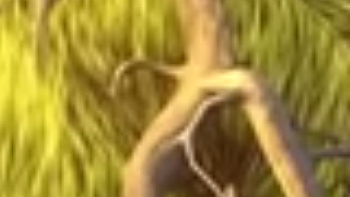
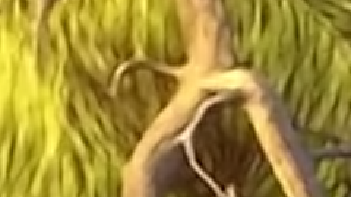
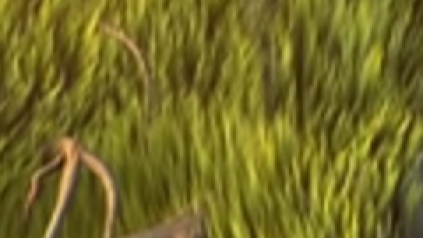
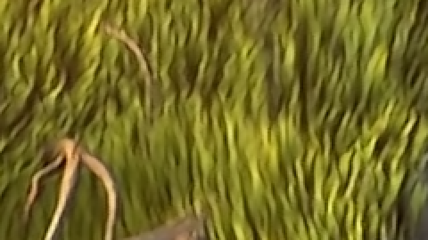
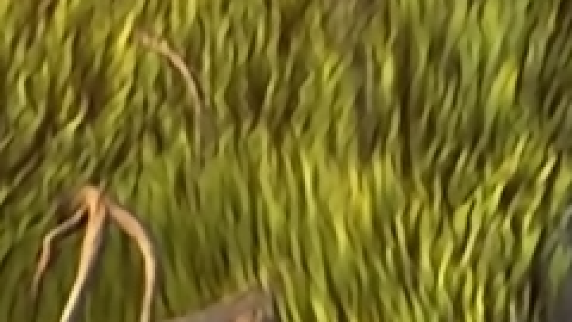
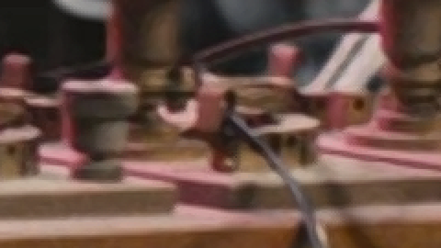

# 01 — Results

All images on this page are **lossless PNG crops of the PS5's scanout**, taken
3840×2160 straight from the frame the console presented. Nothing is
resampled: the zooms use nearest-neighbour, so you see the real output pixels.
Each image is at most 720 px wide, so GitHub shows it pixel for pixel. The
full frames live in `comparisons/<set>/full/`.

## How the captures were taken

Hand-taken screenshots can't land on the same frame twice, so EVO has a
dev-remote command, `upcompare`, that does it deterministically:

1. Pause playback on the current frame.
2. For each mode (Off, Sharp, AI Standard, AI Large, AI Maximum), force the
   upscaler into that mode and hide the on-screen UI.
3. Redraw the held frame until both scanout buffers carry it, then copy the
   front buffer to a BMP on the console's USB drive.
4. Restore the user's settings and pause state.

Every capture in a set therefore has the **same presentation timestamp**
(recorded in `set.json`), and the evo.log line for each confirms which
upscaler actually ran (`active="AI (Maximum)"` and so on). The driver is
[`examples/capture/upcompare_run.py`](../examples/capture/upcompare_run.py).

## The sets

| Set | Source | Upscale | Why it's here |
|---|---|---|---|
| [`bbb-1080p`](../comparisons/bbb-1080p) | *Big Buck Bunny* 1080p H.264, 24.6 Mbps | 2× | Clean, high-bitrate source: the easy case |
| [`bbb-720p-web`](../comparisons/bbb-720p-web) | Same film, re-encoded 1280×720 x264 CRF 24, 2.5 Mbps | 3× | Typical web/anime-release quality |
| [`bbb-540p-web`](../comparisons/bbb-540p-web) | Same film, re-encoded 960×540 x264 CRF 24, 1.6 Mbps | 4× | Hard case: soft and blocky |
| [`tears-of-steel`](../comparisons/tears-of-steel) | *Tears of Steel* 1080p (live action) | 2× | Out-of-domain for Anime4K |

The 720p and 540p files were made from the 1080p file with
`ffmpeg -vf scale=-2:720:flags=bicubic -c:v libx264 -preset slow -crf 24`
(and `540`). That stands in for the compressed anime releases these networks
are trained for.

---

## 540p web encode → 4K (4×)

The hardest case, and where the networks earn their keep. Each image is the
same region at 3× nearest-neighbour:

#### Off (bilinear)


#### Sharp (FSR 1)


#### AI Standard (Anime4K S)


#### AI Large (Anime4K M)


#### AI Maximum (Anime4K UL)


Sheets: [all modes](../comparisons/bbb-540p-web/zoom.png) · [1:1 crops side by side](../comparisons/bbb-540p-web/strip.png) · [Off | AI | Sharp per network](../comparisons/bbb-540p-web/grid.png)

- **Off** smears the grass into a green wash.
- **Sharp (FSR)** restores edge contrast, but also sharpens the x264 blocking,
  giving a crunchy, mottled texture.
- **All three AI networks** rebuild separated blades and a clean outline on
  the root, with far less block noise than FSR.

Metrics: [`metrics.md`](../comparisons/bbb-540p-web/metrics.md).

## 720p web encode → 4K (3×)

#### Off (bilinear)



#### Sharp (FSR 1)


#### AI Standard (Anime4K S)



#### AI Large (Anime4K M)


#### AI Maximum (Anime4K UL)


Sheets: [all modes](../comparisons/bbb-720p-web/zoom.png) · [grid](../comparisons/bbb-720p-web/grid.png)

The same ordering as 540p, slightly less dramatic.

## 1080p clean → 4K (2×)

#### Off (bilinear)



#### Sharp (FSR 1)


#### AI Standard (Anime4K S)



#### AI Large (Anime4K M)



#### AI Maximum (Anime4K UL)


Sheets: [all modes](../comparisons/bbb-1080p/zoom.png) · [grid](../comparisons/bbb-1080p/grid.png)

With a clean source and only 2×, everything is a clear step up from bilinear.
FSR gives the most edge contrast. The networks give a smoother, more natural
result with fewer halos. On this source they mostly agree with each other.

## Tears of Steel (live action) → 4K (2×)

Captured with an earlier build, so only Off, Sharp and AI Standard exist.

#### Off (bilinear)


#### Sharp (FSR 1)



#### AI Standard (Anime4K S)


FSR crisps the brass controls. Anime4K S is only a small step past bilinear.
That's expected: it was trained on anime line art, not photographic texture.

---

## Metrics

"Mean abs diff" is the mean absolute per-channel difference from **Off**, over
the whole 3840×2160 frame, on a 0–255 scale. "Pixels changed" counts pixels
where any channel moved by more than 8. These numbers measure *how much* a
mode changes the picture, not how *good* it is. There is no ground truth: the
4K original of a 540p encode does not exist on the console.

| Set | Sharp | AI Standard | AI Large | AI Maximum |
|---|---|---|---|---|
| bbb-1080p (2×) | 2.74 / 7.0% | 2.13 / 5.6% | 2.08 / 5.8% | 2.09 / 6.7% |
| bbb-720p-web (3×) | 2.12 / 3.4% | 1.90 / 3.7% | 1.84 / 3.7% | 1.83 / 4.5% |
| bbb-540p-web (4×) | 2.02 / 3.1% | 1.86 / 3.2% | 1.80 / 3.2% | 1.77 / 3.8% |
| tears-of-steel (2×) | 0.89 / 0.9% | 0.43 / 0.3% | — | — |

How different the networks are **from each other** (mean abs diff / pixels > 8):

| Set | Large vs Standard | Maximum vs Large | Maximum vs Standard |
|---|---|---|---|
| bbb-1080p | 1.06 / 0.72% | 1.17 / 1.34% | 1.31 / 2.14% |
| bbb-720p-web | 0.79 / 0.23% | 0.92 / 0.43% | 1.04 / 0.84% |
| bbb-540p-web | 0.78 / 0.15% | 0.91 / 0.29% | 1.02 / 0.60% |

- **Maximum is the most distinct network.** It changes the most pixels in
  every set, and it differs from Standard about 2–4× as much as Large does.
- **The difference is colour-aware.** Maximum's residual is a separate
  correction for R, G and B. On the 720p set its colour spread
  (`mean |ΔR − ΔG| + |ΔG − ΔB|`) is **1.69**, against **0.87** for S and M,
  which add one luma residual to all three channels.

## GPU cost

EVO's frame loop already blocks on each frame's end-of-pipe fence right after
submitting it. For frames carrying upscale passes, the submit → retire time is
averaged over 120 frames and logged:

```
agc upscale us=1753 n=120 mode=AI (Large) budget_us=12000 (frame GPU submit->retire, 100 us grain)
```

| Mode | 1080p → 4K, PS5 Pro | Poll grain |
|---|---|---|
| Sharp | ≤ ~1.1 ms | 1 ms |
| AI Standard | ≤ ~1.1 ms | 1 ms |
| AI Large | **~1.75 ms** | 0.1 ms |
| AI Maximum | not yet measured | — |

- **The 1 ms figures are upper bounds.** The GPU was already done at the first
  poll.
- **The figures are whole-frame times**, UI included, not per-pass
  timestamps. See [06 — Lessons](06-lessons-from-hardware.md#timing).
- **The budget is 12 ms.** Two consecutive 120-frame windows over it step the
  network down one size (Maximum → Large → Standard → Sharp → Off) for the rest
  of the session, with one toast.
- **Large at 30 fps** uses about 5% of the frame time. A Pro has plenty of
  headroom.

## Caveats

- **Content.** No commercial anime was used, for copyright reasons. *Big Buck
  Bunny* is clean CGI, and the web re-encodes simulate the soft, blocky source
  Anime4K is designed for. On real low-bitrate anime the gaps between networks
  should be larger. On live action, prefer Sharp.
- **One frame per set.** Differences vary with content and motion.
- **Metrics are change, not quality.** Judge with the crops.
- **Only measured on a PS5 Pro.** Every mode is plain shader code and runs on
  a base PS5 too. It should be slower there (the Pro GPU has ~60% more
  compute), which the budget fallback absorbs.
