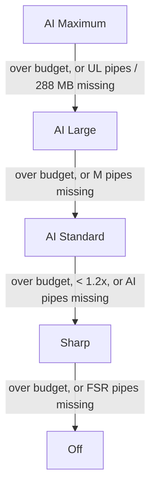

# 02 — The pipeline

The C for everything on this page is
[`examples/runtime/agc_upscale_excerpt.c`](../examples/runtime/agc_upscale_excerpt.c),
copied verbatim from EVO Player's `evo_agc_runtime.c`.

## Background: EVO's present path

EVO does not use a graphics API. Its runtime:

- allocates direct memory for two scanout buffers,
- builds PM4 command buffers itself with `sceAgcDcb*` / `sceAgcCb*`,
- submits them with `sceAgcDriverSubmitDcb`,
- waits on an end-of-pipe fence, and flips with `sceVideoOutSubmitFlip`.

Each video frame is **one textured quad**. The fragment shader samples the
decoder's Y and UV planes, converts BT.601 or BT.2020 YUV to RGB, and the
quad's scale (Fit / Fill / Stretch) is where the only scaling happens:
bilinear, in the texture sampler.

## Where the upscaler hooks in

`evo_agc_blit_yuv()` decides per frame whether to upscale
(`agc_upscale_plan`). If it does, the YUV pass **targets scratch surface `L0`
at source resolution** instead of the scanout, and the chain runs after it:

```
Off      YUV --(quad, bilinear scale)--------------------------------> scanout
Sharp    YUV -> L0 --EASU--> E (output size) --RCAS------------------> scanout
AI  S    YUV -> L0 --conv0..3--> F (ping-pong) --depth-to-space------> scanout
AI  M    YUV -> L0 --conv_k--> F[k%2], acc_k = acc_{k-1} + W_k·crelu(F) --> ... --> scanout
AI  UL   YUV -> L0 --3 passes per layer--> F[set][0..2], 3 accumulators per layer 2..6 --> scanout
```

Three details keep **Off byte-for-byte identical** to the pre-upscaler build,
and make the chain safe:

1. **The footprint is the Off quad's.** `agc_upscale_plan` converts the quad's
   NDC half-extents into a whole-pixel rectangle, clipped to the screen, and
   the UV sub-rectangle of the source it shows. The last pass draws exactly
   that rectangle. Letterbox bars and Fill-mode cropping are untouched.
2. **The L0 bind happens at the last moment.** The blit has several early
   `return -1`s (plane staging can fail). If L0 were bound before them, a
   failure would leave colour target 0 pointing at scratch memory, and the UI
   drawn next would vanish into it. So the switch to L0 is emitted right
   before the draw, and every exit restores the scanout target.
3. **Bypass rules.** HDR/10-bit sources (v1 is SDR 8-bit only), sources not
   smaller than the image (≤ 1.05×), and missing pipelines all fall through to
   Off. AI also needs ≥ 1.2×, Anime4K's own threshold. Each decision is logged
   once per change of source or plan, never per frame:

   ```
   agc upscale: mode=AI net=anime4k-UL src=1280x720 -> rect=0,0 3840x2160 (image 3840x2160, 3.00x) cap=AI
   agc upscale: bypass requested=Sharp reason=HDR source src=3840x2160 ...
   ```

## One pass

Every upscale pass shares one vertex shader and one resource layout, so one
function encodes all 58 upscale pipelines:

```c
static int agc_up_pass(int pipe_id, const agc_up_surface_t *dst,
                       int x, int y, int w, int h, const float uv[4],
                       const agc_up_tex_t *tex, int n);
```

1. Allocate from the frame's transient ring: a 16-byte constant (the UV
   rectangle), its buffer descriptor (V#), and `n` combined image+sampler
   descriptors (T# + S#, 48 bytes each).
2. Point colour target 0 at `dst`. For a scratch surface the target registers
   are rebuilt per call, because the surface's size follows the source.
3. Set the viewport and scissor to `(x, y, w, h)`, bind the pipeline, and
   disable blending.
4. Write the two user-SGPR pointers (vertex constants, fragment texture table)
   at the slots the compiler reported.
5. Draw a 6-index quad.
6. If `dst` is a scratch surface, emit the colour-block flush that doubles as
   the texture-cache barrier (below).

## Scratch surfaces

These are dedicated direct-memory blocks of 36 MB slots, allocated the first
time a mode needs them and freed at shutdown after the GPU drain:

| Block | Slots | Size | Used by |
|---|---|---|---|
| 0 | 5 | 180 MB | every mode |
| 1 | 8 | 288 MB | AI Maximum (UL) only |

| Slot | Sharp | AI S | AI M | AI UL |
|---|---|---|---|---|
| 0 | L0 (RGBA8, source size) | L0 | L0 | L0 |
| 1 | E (RGBA8, output size) | F0 | F0 | features, set A, texture 0 |
| 2 | — | F1 | F1 | features, set A, texture 1 |
| 3 | — | — | A0 | features, set A, texture 2 |
| 4 | — | — | A1 | features, set B, texture 0 |
| 5–6 | — | — | — | features, set B, textures 1–2 |
| 7–9 | — | — | — | accumulators, set A (R, G, B residual) |
| 10–12 | — | — | — | accumulators, set B |

Slots 0–4 are block 0; slots 5–12 are block 1. F and A are RGBA16F at source size. Features and accumulators ping-pong
between sets A and B, so a pass never reads and writes the same surface.

**Why not reuse the UI's layer pool?** EVO's UI (RmlUi) CPU-clears a layer
when it acquires one. Clearing a surface the GPU is still upscaling the
previous frame from would corrupt one or the other.

**Why 36 MB slots?** Colour targets here are **tiled** (64 KB blocks). A 4K
RGBA8 surface occupies 30 × 17 blocks = 33.4 MB, not its 31.6 MB linear size.
Feature maps are RGBA16F at source size: 16.7 MB at 1080p.

## Barriers

Each pass samples what the previous one wrote. Between passes EVO emits
`RELEASE_MEM` with event 45 (`FLUSH_AND_INV_CB_DATA_TS`) and GCR control `0xC`:

- **The CB flush** pushes the colour block's writes out to L2.
- **`GLV_INV | GL1_INV`** invalidates the texture caches. Without it, a
  ping-pong surface read in pass *k*, rewritten in *k + 1* and read again in
  *k + 2* could return stale lines from the first read.

This is the same barrier EVO's UI blur uses between its horizontal and
vertical passes.

## Fallbacks and the GPU budget



- **Budget check.** The frame loop already waits on each frame's fence after
  submitting it. For upscaled frames that wait is timed, at 0.1 ms steps, and
  averaged over 120 frames. Two consecutive windows over 12 ms step down one
  level for the session and raise one toast.
- **Resetting the cap.** Choosing a mode again in Settings resets it.
